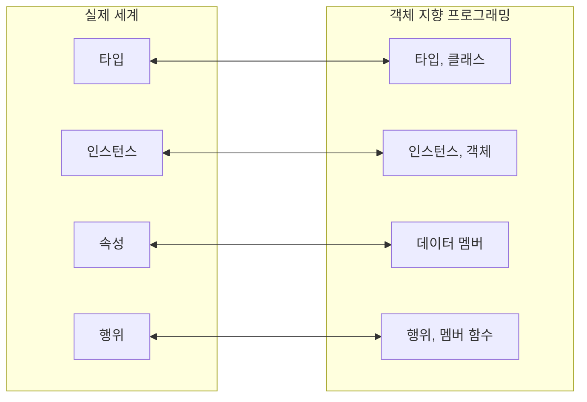

### 1. 클래스의 개요
#### 1. 타입과 인스턴스
- 타입을 통해 인스턴스를 생성할 수 있다. 타입은 어떠한 것의 정의나 집합, 인스턴스는 개별화된 것.

	**속성(attribute)**
		속성은 **인스턴스가 가지는 특징**이다.
		   e.g.) 인스턴스: 학생
		      속성: 이름, 학년, 학점 etc...

	**행위(behavior)**
	 인스턴스는 어떤 행위를 가진다. 여기서 **행위란, 어떤 인스턴스가 스스로 할 수 있는 작업 혹은 연산을 의미**한다.
	   e.g.) 인스턴스: 학생
		  행위: 이름, 학년 학점 등을 지정해 줄 수 있다.

#### 2. 클래스와 객체
 - C++에서는 Type과 Instance라는 용어를 자주 사용한다. C++는 클래스라는 구문을 사용하여 타입을 생성. 클래스를 기반으로 만든 인스턴스가 객체, 혹은 그냥 인스턴스라고 부름.
 - 객체 지향 프로그래밍에서 객체의 속성과 행위는 데이터 멤버와 멤버 함수로 만든다.

	**데이터 멤버**
		객체의 데이터 멤버는 속성을 표현하기 위한 변수.
			e.g.) 객체: 원
				데이터 멤버: 반지름

	**멤버 함수**
		객체의 행위를 구현하는 함수.

